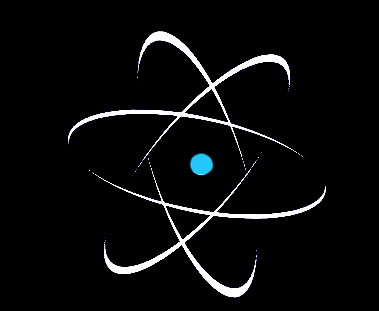

# JUSTATOM.org : _research_


<p align="center">
    
</p>

_This is non official project showing showcasing interesting results during development [JUSTanATOM](https://justatom.org)_
====================================

<h2 align="center">Semantic Textual Similarity</h2>

A typical NLP machine learning task involves classifying a sequence of tokens such as a sentence or a document, i.e. approximating a function
```python
f_1(s) ∈ [0,1]
```
(where mapping itself may determine a domain, sentiment, etc.).  But there is a large class of problems that are often harder and involve classifying a *pair* of
sentences:
```python
f_2(s1, s2) ∈ [0,1]*c
```
(where s1, s2 are sequences of tokens and c is a rescaling factor like c=5)

Typically, the function *f_2* denotes some sort of **semantic similarity**,
that is whether (or how much) the two parameters "say the same thing".

<h2 align="center">Definition</h2>

Assign a number between `0` to `5` to each pair denoting the level of
similarity/entailment.

<h2 align="center">Examples</h2>

Below are two examples demonstraiting _weight distribution_ with the help of <a href="https://arxiv.org/abs/1810.04805"> BERT 
</a> model to solve <a href="#definition">STS</a> problem.

### _Starwars_
Introductory text being at the beginning of the movie <a href="https://en.wikiquote.org/wiki/Star_Wars:_Episode_II_%E2%80%93_Attack_of_the_Clones">Star Wars: Episode II</a> in `russian` languge.


<p>
<i>В Галактическом Сенате неспокойно. Несколько тысяч звёздных систем объявили о намерении выйти из состава Республики.

Движение сепаратистов, возглавляемых загадочным графом Дуку, создало трудности малочисленным джедаям для сохранения мира и порядка в галактике.

Сенатор Амидала, бывшая королева Набу, возвращается в Галактический Сенат, чтобы голосовать по принципиальному вопросу: созданию АРМИИ РЕСПУБЛИКИ в помощь не справляющимся джедаям...
</i>
</p>


### _Syntatic example_
Text created to emphasize the ability of the model to differentiate the context between the same words inside one sentence. In this example note different weight coefficients for the word `ключ` in `russsian` language.
<p>
<i>
Ключ к понимаю искусственного интеллекта, способного понимать смысл текста, лежит в осознании факта, что контекст играет решающую роль при построении модели, а ключ от квартиры лучше не терять.
</i>
</p>

